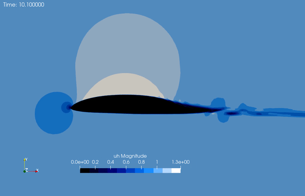

# SegregatedVMSSolver

**Documentation**

[](https://carlodev.github.io/SegregatedVMSSolver.jl/stable/)
[](https://carlodev.github.io/SegregatedVMSSolver.jl/dev/)
[](https://github.com/carlodev/SegregatedVMSSolver.jl/actions/workflows/CI.yml?query=branch%3Amaster)
[](https://codecov.io/gh/carlodev/SegregatedVMSSolver.jl)

*SegregatedVMSSolver.jl for solving incompressible Navier-Stokes using stabilized Finite Element Method, in specific Streamline-Upwind Petrov-Galerkin (SUPG) and Variational MultiScale method (VMS)*



## Introduction
The package solves the incompressible Navier-Stokes equations using SUPG and VMS method. VMS has been originally introduced by [Hughes2000](@cite). In specific, a linearized and segregated version of the SUPG (following the steps illustrated by [Janssens2014](@cite)) and VMS is solved. 

The methods belong to the Large Eddy Simulation (LES) family. The package can solve the `Taylor Green Vortices` (only 2D), `Lid Driven Cavity Flow` (only 2D), `Cylinder vortex shedding` (only 2D), and general `Airfoils` (2D and 3D). 

It works fully in parallel (tested up to 80-CORES). It is specialized for the resolution of flow over airfoils, testing the capability of detecting the Laminar Separation Bubble. It is equipped with some utility `modules` for reading the output files and creating proper initial conditions.

## Installation
The package is registered, so you can install it as:
```julia
using Pkg
Pkg.add(SegregatedVMSSolver)
```

or from the `REPL` just press `]`.

```example
(@1.8) pkg> add SegregatedVMSSolver
```

You can use the most recent release installing it as:
```julia
using Pkg
Pkg.add(url="https://github.com/carlodev/SegregatedVMSSolver.jl")
```

## Suggested software to install

For a complete and smooth experience is suggested to install the free software [ParaView](https://www.paraview.org/) which allows to graphically visualize the results and open `.vtu` and `.pvtu` files.
For creating mesh and physical boundary conditions is suggested to install the free software [`gmsh`](https://gmsh.info/).

## Features
- Implementation of SUPG and VMS formulation for same-order elements for velocity and pressure
- Solve 3D airfoils geometries, time-dependend, fully parallelized code
- Using custom Meshes created with [`gmsh`](https://gmsh.info/). For airfoils the package `AirfoilGmsh.jl` has been developed for speeding up the process
- Solve 2D and 3D cases
- Possibility of choosing the backend thanks to `PartitionedArrays.jl`. It can be run in the `REPL` for debugging or in `MPI`


## Examples

|   [Taylor-Green Vortices](https://carlodev.github.io/SegregatedVMSSolver.jl/dev/Cases/taylorgreen/) |    [Lid Driven Cavity Flow](https://carlodev.github.io/SegregatedVMSSolver.jl/dev/Cases/liddriven/) |
|:-------------:|:-------------:|

|   [Cylinder Vortex Shedding](https://carlodev.github.io/SegregatedVMSSolver.jl/dev/Cases/cylinder/)  |  [Airfoil](https://carlodev.github.io/SegregatedVMSSolver.jl/dev/Cases/airfoil/)   | 
|:-------------:|:-------------:|


## Packages
It relies on the  [`Gridap`](https://github.com/gridap/Gridap.jl) ecosystem. It is also completely written in Julia and allows parallelization. The [`MPI`](https://github.com/JuliaParallel/MPI.jl) and [`PartititionedArrays`](https://github.com/fverdugo/PartitionedArrays.jl) are also at the basis of the parallelization.