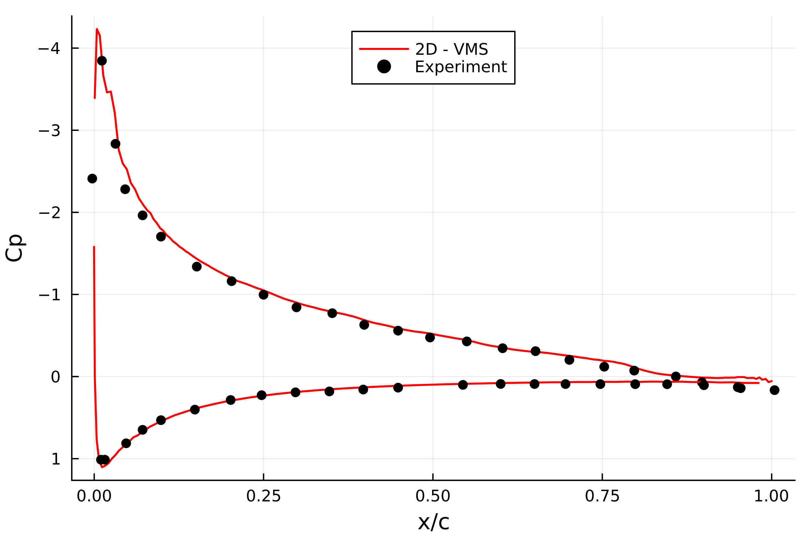

# Airfoil


It is one of the most complex and interesting case. The user has to create a proper mesh in [`gmsh`](https://gmsh.info/) setting the following physical boundaries:
- `inlet` for the inlet
- `outlet` for the outlet
- `airfoil` for the airfoil walls
- `limits` for the top and bottom boundaries

!!! info ".geo file" 
    In the folder `models/` is possible to find some `.msh` file created using [`gmsh`](https://gmsh.info/) both for 3D and 2D simulations. 
    In the folder `models/geo` are available some `.geo` that can be open in [`gmsh`](https://gmsh.info/).
    Different parameters can be modified: angle of attack, domain dimension, mesh divisions.

The velocity at the inlet is increased from `0.0` arriving to the target value `u_in` at `t_endramp`. This increase the numeric stability. If `t_endramp` = `t0` the velocity at the inlet will be immediately `u_in`. For numeric stability is better to keep `u_in = [1.0,0.0,0.0]`, then fix the Reynolds and so the viscosity will be automatically computed as: `ν = 1/Reynolds`

The pressure is set `0.0` at the `outlet` section. The velocity on the `limits` is set equal to the one at `inlet`.

3D LES are heavy and it is possible to experience divergence issues. It is suggested to use one of the two initialization techniques: `Velocity ramping` or `Boundary layer initialization`. For visualize the results, please refer to the section. 


## NACA0012
A common validation test case is to analyze the NACA0012 airfoil and compare the pressure distribution with experimental results. This is a simple 2D simulation at high Reynolds number ``3e6``. For run this case it is suggested to have `hypre` installed to use a more powerful preconditioner for the resolution. It has been tested on 16 CORES and requires approximately 35 hours.


### Simulation File
```julia
using PartitionedArrays
using SegregatedVMSSolver
using SegregatedVMSSolver.ParametersDef
using SegregatedVMSSolver.SolverOptions
```

Set the physical parameters of the simulation
```julia
t0 =0.0
dt = 0.00025
tF = 15.0

Re = 3_000_000
D = 2
rank_partition = (16,1,1)
mesh_file = joinpath(@__DIR__, "NACA 0012_2D_A10.msh")
```

Setting the parameters of the simulation
```julia
sprob = StabilizedProblem(VMS(1))
timep = TimeParameters(t0=t0,dt=dt,tF=tF,t_endramp=2.0)

physicalp = PhysicalParameters(Re=Re)
solverp = SolverParameters(M=25,Number_Skip_Expansion=1e6, petsc_options = petsc_options_cstm(), matrix_freq_update=1)
exportp = ExportParameters(printinitial=true,printmodel=true,name_tags=["airfoil"], fieldexport=[["ph","friction"]])


meshp= MeshParameters(rank_partition,D,mesh_file)

simparams = SimulationParameters(timep,physicalp,solverp,exportp)

AirfoilCase = Airfoil(meshp,simparams,sprob)

```


Solve in Sequential - on 1 processor not using MPI, useful for debug.
```julia
 SegregatedVMSSolver.solve(AirfoilCase,with_debug)
```

Solve in MPI - for HPC computing
```julia
 SegregatedVMSSolver.solve(AirfoilCase,with_mpi)
```

Then in bash give the command. Check the MPI section for more details
```bash
 mpiexecjl -n 4 julia --project=. run_mysimulation.jl
```


### Results
The results can be post-processed using the following script. The first `10000` time-steps are skipped to avoid the initial transient.

```julia

using Pkg
Pkg.activate("../.")
using SegregatedVMSSolver
using SegregatedVMSSolver.ReadAirfoilResults
using Plots, LaTeXStrings, KissSmoothing
using CSV, DataFrames
using JLD2

Case = "NACA0012"
α = 10.0


res_path = joinpath(@__DIR__, "$(Case)_A$(Int64(α))", "Results/") 


Re = 3_000_000

der_slope= -1.0


u0 = 1.0
c = 1.0
rho = 1.0
μ = u0*c*rho/Re


nodes, normals = get_geometry_info(res_path;α=α, der_slope= der_slope)

Ph = time_space_average_field(res_path, "ph", nodes; offset=10_000)

cp_top, cp_bottom = extract_Cp(nodes, Ph; u0=u0, rho=rho)


plot(nodes.top.x ./ cosd(α), cp_top, label = "2D - VMS", color = :red, linewidth = 1.5)
plot!(nodes.bottom.x./ cosd(α), cp_bottom, label = false, color = :red, linewidth = 1.5)
yflip!()
plot!(xlabel="x/c", ylabel="Cp", legend=:top)
```

