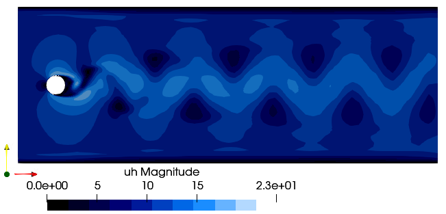

# Cylinder



The Cylinder case can be used to see how meshes created in  [`gmsh`](https://gmsh.info/) are manged and to obtain the vortex shedding phenomena.
The user has to create a proper mesh in [`gmsh`](https://gmsh.info/) setting the following physical boundaries:
- `inlet` for the inlet
- `outlet` for the outlet
- `cylinder` for the cylinder walls
- `limits` for the top and bottom boundaries

```julia
using PartitionedArrays
using SegregatedVMSSolver
using SegregatedVMSSolver.ParametersDef
using SegregatedVMSSolver.SolverOptions

t0 =0.0
dt = 0.1
tF = 0.5

Re = 100
D = 2
rank_partition = (2,2)
cylinder_mesh_file = joinpath(@__DIR__,"..", "..", "models", "Cylinder_2D.msh")


sprob = StabilizedProblem(SUPG(1))
timep = TimeParameters(t0,dt,tF)

physicalp = PhysicalParameters(Re=Re)
solverp = SolverParameters()
exportp = ExportParameters(printinitial=false,printmodel=false)


meshp= MeshParameters(rank_partition,D,cylinder_mesh_file)
simparams = SimulationParameters(timep,physicalp,solverp,exportp)


mcase = Cylinder(meshp,simparams,sprob)

SegregatedVMSSolver.main(mcase,backend)
```