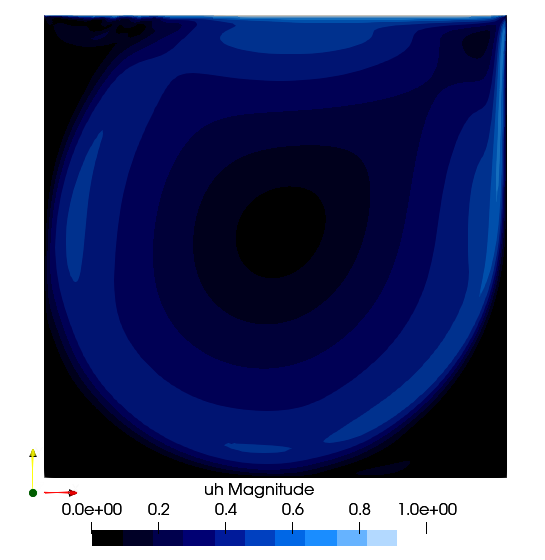

# Lid Driven Cavity Flow



The Lid Driven Cavity flow is another standard case. It is a box of 1x1 dimension with the top side that can slide. The user can set different Reynolds.


```julia
using PartitionedArrays
using SegregatedVMSSolver
using SegregatedVMSSolver.ParametersDef
using SegregatedVMSSolver.SolverOptions

t0 =0.0
dt = 0.1
tF = 3.0
t_endramp=2.0

Re = 1000
D = 2
rank_partition = (2,2)


sprob = StabilizedProblem(method=VMS(), coeff_method=ScalarFormulation())
timep = TimeParameters(t0=t0,dt=dt,tF=tF, t_endramp=t_endramp)

physicalp = PhysicalParameters(Re=Re)
solverp = SolverParameters()
exportp = ExportParameters(printinitial=false,printmodel=false)


meshp= MeshParameters(rank_partition,D;N=32,L=0.5)
simparams = SimulationParameters(timep,physicalp,solverp,exportp)


mcase = LidDriven(meshp,simparams,sprob)

SegregatedVMSSolver.main(mcase,with_debug)

```