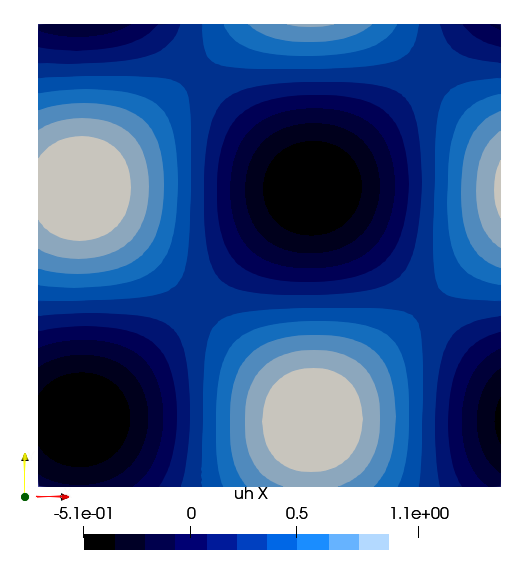

# Taylor Green Vortex


It solves the 2D Taylor Green Vortex case. It is the only case where analtical solution are available:


``u_x= U_{a}-V_{s} \cos \bigg (\frac{\pi}{D}(x-U_{a} t)\bigg ) \sin \bigg (\frac{\pi}{D}(y-V_{a} t)\bigg ) e^{-\frac{2 v \pi^{2}}{D^{2}} t}``

``u_y= V_{a}+V_{s} \sin \bigg (\frac{\pi}{D}(x-U_{a} t)\bigg ) \cos \bigg (\frac{\pi}{D}(y-V_{a} t)\bigg ) e^{-\frac{2 \nu \pi^{2}}{D^{2}} t}``

``p=-\frac{V_{s}^{2}}{4}\bigg ((\cos(2 \frac{\pi}{D}(x-U_{a} t) )+\cos (2 \frac{\pi}{D}(y-V_{a} t))\bigg ) e^{-\frac{4 v \pi^{2}}{D^{2}} t}``

``\omega=\frac{2 V_{s} \pi}{D} \cos \bigg (\frac{\pi}{D}(x-U_{a} t)\bigg ) \cos \bigg (\frac{\pi}{D}(y-V_{a} t)\bigg ) e^{-\frac{4 \nu \pi^{2}}{D^{2}} t}``

Because of an analytical solution it is used as a benchamark case for verifing mesh convergence, CFL stability and processor scalability. The domain is a squqare of `2Dx2D` with periodic boundaries over the 4 sides. The initial solution is retrived from the analytical solution. The pressure is fixed in the centre of the domain equal to the analytical solution. 
The parameters set by the user are overwritten by the following standard values:
- ``Vs = 1\;m/s`` swirling velocity
- ``Ua = 0.2\;m/s`` translational velocity in $x$ direction
- ``Va = 0.3\;m/s`` translational  velocity in $y$ direction
- ``D = 0.5\;m`` vortex dimensions
- ``\nu = 0.001\; m^2/s``

```julia
using PartitionedArrays
using SegregatedVMSSolver
using SegregatedVMSSolver.ParametersDef
using SegregatedVMSSolver.SolverOptions


t0 =0.0
dt = 0.1
tF = 0.5

Re = 1000
D = 2
rank_partition = (2,2)


sprob = StabilizedProblem(VMS(1))
timep = TimeParameters(t0=t0,dt=dt,tF=tF)

physicalp = PhysicalParameters(Re=Re)
solverp = SolverParameters()
exportp = ExportParameters(printinitial=false,printmodel=false)
```

We create a mesh of 32x32 elements

```julia
meshp= MeshParameters(rank_partition,D;N=32,L=0.5)
simparams = SimulationParameters(timep,physicalp,solverp,exportp)


mcase = TaylorGreen(meshp,simparams,sprob)

SegregatedVMSSolver.main(mcase,with_debug)
```