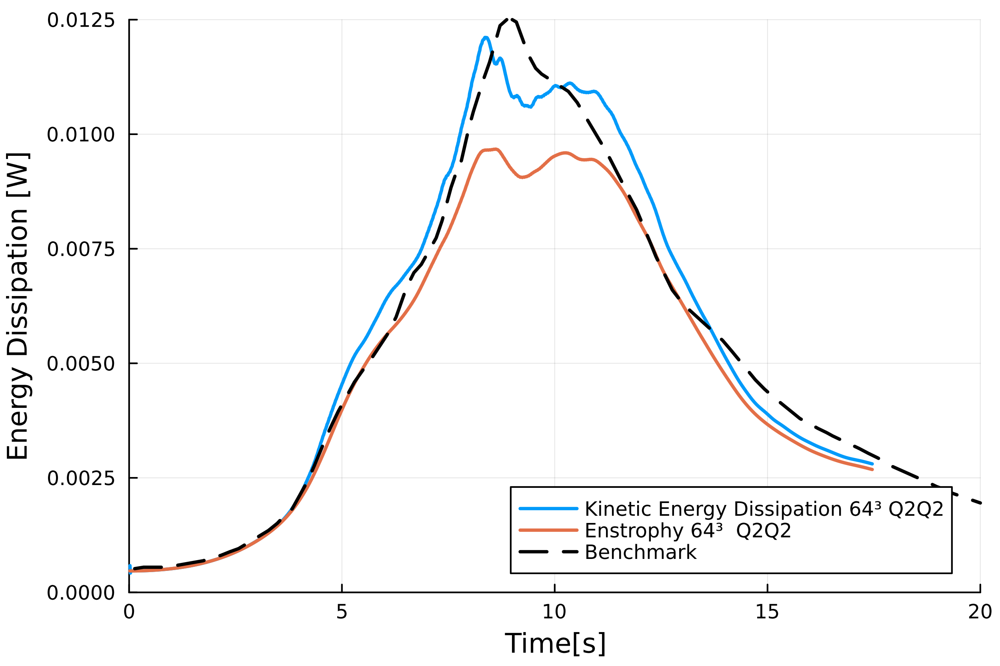

# Taylor Green Vortex 3D
The Taylor-Green Vortex (TGV) is a canonical test case for the study of transition to turbulence and energy dissipation in incompressible flows. The flow is initialized in a cubic domain with periodic boundary conditions imposed on all sides. The domain extends from ``-\pi`` to ``\pi`` in each spatial direction (`x`, `y`, `z`).

The initial velocity components of the TGV in 3D are given by:

``u(x, y, z, 0) = U_0 \cos(kx) \sin(ky) \sin(kz)``

``v(x, y, z, 0) = -U_0 \sin(kx) \cos(ky) \sin(kz)``

``w(x, y, z, 0) = 0``

where ``U_0`` is the velocity amplitude, ``k`` is the wave number, and ``(x, y, z)`` are the spatial coordinates. In this case ``U_0=0.0`` and ``k=1``.

The corresponding initial pressure field is:

``p(x, y, z, 0) = \frac{U_0^2}{16} \left[ \cos(2kx) + \cos(2ky) \right] \cos(2kz+2)``


``E(t) = \frac{1}{2 \Omega} \int_\Omega |\boldsymbol{u}|^2 \, d\Omega``

where ``\boldsymbol{u} = (u, v, w)`` is the velocity vector, and ``\Omega`` is the volume of the domain.

The rate of decay of kinetic energy is linked to enstrophy ``\mathcal{E}(t)``, which is defined as:

``\mathcal{E}(t) = \frac{1}{\Omega} \int_\Omega |\boldsymbol{\omega}|^2 \, d\Omega``

where ``\boldsymbol{\omega} = \nabla \times \boldsymbol{u}`` is the vorticity vector. For incompressible flows, the decay rate of kinetic energy is governed by viscous dissipation:

`` \frac{dE(t)}{dt} = -\nu \mathcal{E}(t)``

where ``\nu`` is the kinematic viscosity of the fluid.
This relationship demonstrates that the rate at which kinetic energy decreases is directly proportional to the enstrophy, which quantifies the rotational intensity of the flow.


### Simulation File
```julia
using PartitionedArrays
using SegregatedVMSSolver
using SegregatedVMSSolver.ParametersDef
using SegregatedVMSSolver.SolverOptions
using MPI

t0 =0.0
dt = 0.01
tF = 20
vortex_diameter = 1.0
N = 64
Re = 1600
D = 3

backend = with_mpi
rank_partition = (4,4,4)
order = 2

solver_options = petsc_options(; vel_ksp="gmres", vel_pc="gamg", pres_ksp = "cg", pres_pc = "asm")
sprob = StabilizedProblem(VMS(order))
timep = TimeParameters(t0=t0,dt=dt,tF=tF)

physicalp = PhysicalParameters(Re=Re,c=vortex_diameter)
solverp = SolverParameters(matrix_freq_update = 5, Number_Skip_Expansion=10e6, M = 40,
petsc_options = solver_options)
exportp = ExportParameters(printinitial=true, printmodel=true, 
vtu_export = ["uh","ph"], extra_export=["KineticEnergy", "Enstrophy"])


meshp= MeshParameters(rank_partition,D;N=N,L= pi*vortex_diameter)
simparams = SimulationParameters(timep,physicalp,solverp,exportp)

bc_tgv = Periodic(meshp,physicalp ) 

mcase = TaylorGreen(bc_tgv, meshp,simparams,sprob)

SegregatedVMSSolver.solve(mcase,backend)
```
at each time-step, a new line on a `.csv` file will be written with: timestep-KineticEnergy-Enstrophy. You can use this file to compare with available DNS results.

### Results

The Linearized and Segregated VariationalMultiScale method has been validated with test case. The time-step is constant ``\Delta t =0.01s``, the matrices are re-computed every 5 time-steps. The Reynolds number is ``1600``, it is used to compute the viscosity: ``\nu = U_0 k / Re``. Order of interpolation of velocity and pressure is the same. The benchmark is the DNS result. The flow patterns generated by the Taylor-Green vortex are quite complex. The resolution of the most complex case tested: 64x64x64 Q2Q2, takes 40 hours on a 64CORE machine.

We note that the kinetic energy decay does not match that of the reference for Q1 elements, there is significant numerical dissipation since the enstrophy does not match the kinetic energy decay.


Increasing the order from Q1 to Q2 yield the following results which are better.



