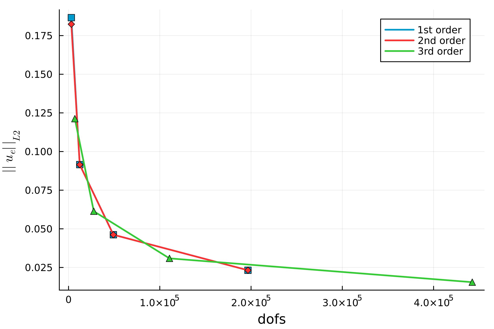
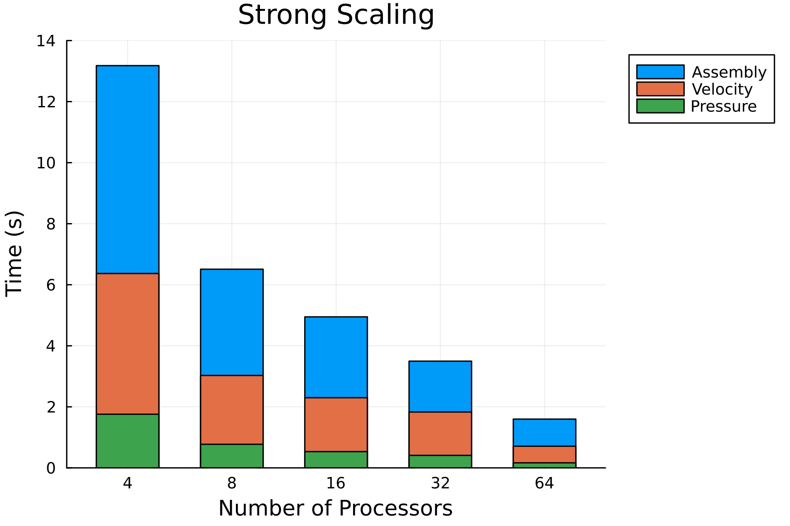
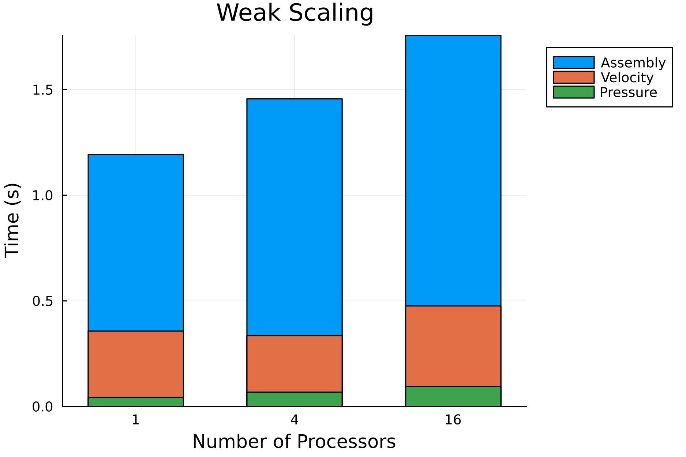

# Error Assessment
In this section is possible to appreciate the error decrease increasing the order or the mesh refinement - while using the VMS stabilization.
2D Taylor-Green vortex case is used as benchmark case to assess the error analysis of the code. The domain is a square of size: [-0.5,0.5]x[-0.5,0.5], at Reynolds number 1600. The CFL is constant for each simulation, CFL=0.32. The time-step is compted as ``dt = CFL / (order\cdot N) ``.

# Parallelization
In this section is possible to appreciate the weak and strong scalability of the implementation of the code. The benchmark case is the 2D taylor Green, the time reported here are intended for each time-step. The order of the elements for this simulation is always 2, and the CFL constant at 0.32

|           | Preconditioner   | Linear Solver   |
|-----------|------------------|-----------------|
| Velocity  | `gamg`           |       `gmres`   |
| Pressure  | `gamg`           |          `cg`   |

For parallelization is used `MPI`, and to solve the sparse and distribute numerical systems we use `PETSc`

## Strong Parallelization
Strong scalability evaluates how efficiently a parallel code reduces execution time when the problem size remains fixed, but the number of processing units increases. There is a total of `400` elements on each side, leading to `160000` elements and `1920000` dofs in total.

## Weak Parallelization
Weak scalability measures how well a parallel code maintains performance when the problem size is kept constant per processor, and the number of processors increases. On each processor there are `50x50` elements, the number of dofs is kept constant at ``\approx`` `30K dfos/procs`.

