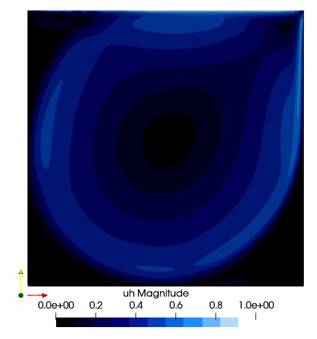
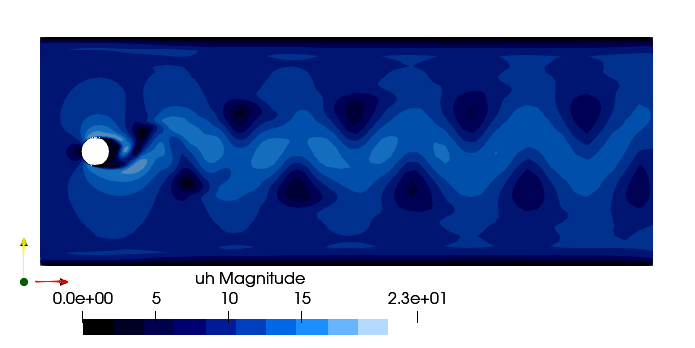

# Summary
Large-Eddy Simulation (LES) is a family of mathematical techniques that perform high-fidelity simulations in Computational Fluid Dynamics (CFD). They can simulate turbulent flows by numerically solving the Navier-Stokes equations. Using filtering operation, LES focuses on the larger length scale, while the effects of small scales (subgrid scales) are modeled. The Variational MultiScale (VMS) and Streamline-Upwind/Petrov-Galerkin (SUPG) methods belong to the family of stabilized methods. The mathematical problem is solved using the Finite Element Method (FEM) framework. They allow to simulate complex flows. The package has been developed with the primary aim of studying the Laminar Separation Bubble (LSB) at low-Reynolds regime on the suction side of the airfoils. 

One of the primary objectives of `SegregatedVMSSolver.jl` is to empower users with different levels of expertise in CFD to run simulations seamlessly. For users with a basic understanding of CFD principles, the package aims to provide a framework where simulations can be executed without the need for detailed parameters input. 

However, for more advanced users who may desire greater control over the simulation process, it is possible to provide custom options for customizing almost all aspects of the method: solver, model, exports and HPC options. This customization empowers users to fine-tune parameters according to their specific requirements.

Balancing between simplicity for novice users and flexibility for advanced users, the package ensures usability without compromising on the depth and sophistication of the simulation capabilities. This approach makes the package versatile and adaptable to a wide range of users, from researchers seeking quick insights to seasoned practitioners, using HPC, aiming for comprehensive analyses in fluid dynamics applications.

# Statement of need
`SegregatedVMSSolver.jl` is a comprehensive Julia package designed for conducting high-fidelity simulations of complex flow phenomena whithin the incompressible regime, leveraging VMS and SUPG method. VMS has been originally introduced in [@Hughes:2000]. The linearization adopted has been proposed in the SUPG method in [@Banyai:2016].

The package relies on `Gridap.jl`[@Verdugo:2022],[@Badia:2020] package to implement the mathematical model of FEM. Complementing this core functionality, `GridapDistributed.jl`[@BadiaD:2022] and [`PartitionedArrays.jl`](https://github.com/fverdugo/PartitionedArrays.jl) allow to use multi-core CPU desktop computers to HPC clusters. The [`GridapPETSc.jl`](https://github.com/gridap/GridapPETSc.jl) package is used to solve the final linear system. 

It solves a Linearized and Segregated version of VMS (LS-VMS) and SUPG. It is based on an iterative predictor-corrector scheme and it avoids the resolution of a non-linear problem.
It uses the $\theta$ method to solve the time-marching problem. 

This package focuses on solving fluid dynamics problems, with a particular emphasis on the study of 2D and 3D airfoil aerodynamics at low Reynolds numbers (tested up to 500,000). The primary objective is to provide researchers and engineers with a versatile tool for analyzing aerodynamic features in this regime.

A suite of benchmark cases is implemented to ensure reliability and applicability across a range of scenarios. These include:
- **Taylor-Green vortices**: Simulated in both 2D and 3D.
- **Lid-driven cavity**: Solvable in 2D; the 3D version is not currently supported.
- **Vortex shedding over a cylinder**: Available in both 2D and 3D.
- **Airfoil aerodynamics**: Extensive support for both 2D and 3D simulations.

This comprehensive implementation ensures that the package can address a variety of fluid dynamics problems, while its focus on 2D and 3D airfoil analysis fills a gap in the current Julia ecosystem for low-Reynolds-number aerodynamic studies.

It has a suite of tools for post-processing the results like performing time and spanwise averaging, obtaining. It is possible to control the simulation in real-time, enabling/disabling the creation of output files at each time-step. The user can load own airfoil meshes also usign the package [`AirfoilGmsh.jl`](https://github.com/carlodev/AirfoilGmsh.jl). Additionally, the package provides tools for initializing boundary layers in 2D simulations, enhancing its versatility and utility for researchers and practitioners in the field of fluid dynamics.

The field of fluid dynamics in Julia has seen significant growth, with several software packages emerging to address various computational challenges. This reflects the growing interest and engagement of the Julia community in this domain. A comprehensive list of packages can be found on [Julia Packages - Fluid Dynamics](https://juliapackages.com/c/fluid-dynamics). Among the most notable are:

- **[Trixi.jl](https://github.com/trixi-framework/Trixi.jl)**: A framework for numerical simulation of hyperbolic PDEs, particularly suited for high-order methods and adaptive mesh refinement.
- **[WaterLily.jl](https://github.com/WaterLily-jl/WaterLily.jl/tree/master)**: A tool focused on simulating fluid flows using a Lattice Boltzmann method, aimed at educational and research applications.
- **[Oceananigans.jl](https://github.com/CliMA/Oceananigans.jl)**: A GPU-accelerated model for simulating incompressible fluid dynamics, widely used in geophysical and oceanographic studies.

While these packages vary in scope and functionality, they collectively highlight the flexibility and performance benefits of Julia in computational fluid dynamics. However, the ecosystem is still maturing compared to more established environments like Python or MATLAB. This paper contributes to this evolving field by introducing a new package tailored for Large Eddy Simulations.

## Results

{ width=50%  }
{ width=50%  }
{ width=50%  }
{ width=50%  }

{ width=50%  }

Figure \ref{fig:cfsd7003} shows the comparison of the time averaged results obtained using the LS-VMS, compared with the results obtained in [@Calderer:2013] and in [@Galbraith:2008].

# Package Features
- Support 2-dimensional and 3-dimensional geometries
- It solved a time-dependent problem
- It can run in parallel using MPI
- Velocity ramping
- It can capture the laminar-to-turbulent transition
- It has utilities for time and space averaging
- It supports advanced boundary layer initialization
- Real-time simulation interaction
- The solution can be visualized in ParaView
- Restart the simulation from a specific saved time-step

# Acknowledgements
The authors would like to acknowledge the Royal Higher Institute for Defense for funding this research through the project MSP21/02 Numerical and Experimental Low Speed High Altitude Wing (NELSHAW).  Many thanks professor Bart Janssens for his invaluable support, patience and feedback.

# References
