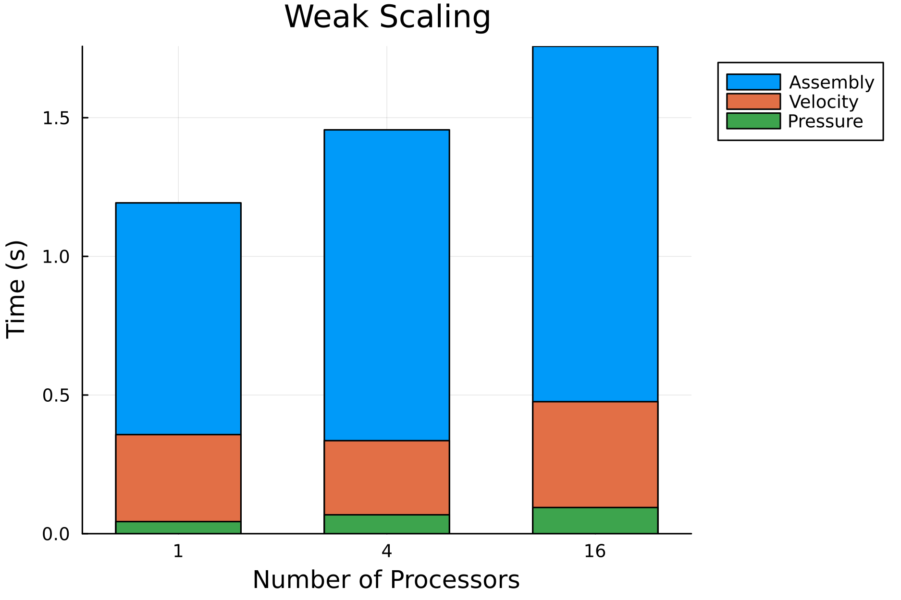

# Summary
Large-Eddy Simulation (LES) is a family of mathematical techniques that perform high-fidelity simulations in Computational Fluid Dynamics (CFD). They can simulate turbulent flows by numerically solving the Navier-Stokes equations. Using a filtering operation, LES focuses on the larger length scale, while the effects of small scales (subgrid scales) are modeled. The Variational MultiScale (VMS) and Streamline-Upwind/Petrov-Galerkin (SUPG) methods belong to the family of stabilized methods. The mathematical problem is solved using the Finite Element Method (FEM) framework. They allow the simulation of complex flows. The package has been developed with the primary aim of studying the Laminar Separation Bubble (LSB) at low-Reynolds regime on the suction side of the airfoils. 

`SegregatedVMSSolver.jl` is designed to be user-friendly for both novice and advanced users. Novice users can run simulations with minimal input, while advanced users have the flexibility to customize parameters for detailed control. This dual approach ensures that the package is accessible and versatile.

However, for more advanced users who may desire greater control over the simulation process, it is possible to provide custom options for customizing almost all aspects of the method: solver, model, exports and HPC options. Balancing simplicity for novice users and flexibility for advanced users, the package ensures usability without compromising on the depth and sophistication of the simulation capabilities. This approach makes the package versatile and adaptable to a wide range of users, from researchers seeking quick insights to seasoned practitioners, using HPC, aiming for comprehensive analysis in fluid dynamics applications.

# Statement of need
`SegregatedVMSSolver.jl` is a comprehensive Julia package designed for conducting high-fidelity simulations of complex flow phenomena within the incompressible regime, leveraging the VMS and SUPG method. VMS has been originally introduced by @Hughes:2000. The linearization adopted has been proposed in the SUPG method by @Banyai:2016. 
The package relies on the `Gridap.jl` package [@Verdugo:2022; @Badia:2020] to implement the mathematical model of FEM. Complementing this core functionality, `GridapDistributed.jl` [@BadiaD:2022] and `PartitionedArrays.jl` [@Verdugo:2025] allow the use of multi-core CPUs desktop computers to HPC clusters. The `GridapPETSc.jl` [@GridapPETSc:2025] package is used to solve the final linear system. 
It solves a Linearized and Segregated version of VMS (LS-VMS) and SUPG. It is based on an iterative predictor-corrector scheme and it avoids the resolution of a non-linear problem. It uses the $\theta$ method to solve the time-marching problem. 

This package focuses on solving fluid dynamics problems, with a particular emphasis on the study of 2D and 3D airfoil aerodynamics at low Reynolds numbers (tested up to 500,000). The primary objective is to provide researchers and engineers with a versatile tool for analyzing aerodynamic features in this regime. 
A suite of benchmark cases is implemented to ensure reliability and applicability across a range of scenarios. These include:

- **Taylor-Green vortices**: Simulated in both 2D and 3D.
- **Lid-driven cavity**: Solvable in 2D; the 3D version is not currently supported.
- **Vortex shedding over a cylinder**: Available in both 2D and 3D.
- **Airfoil aerodynamics**: Extensive support for both 2D and 3D simulations.

It also has a suite of tools for post-processing the results like performing time and spanwise averaging. It is possible to control the simulation in real-time, enabling/disabling the creation of output files at each time-step. The user can load their own airfoil meshes also using the package `AirfoilGmsh.jl` [@BrunelliGmsh:2025] . Additionally, the package provides tools for initializing boundary layers in 2D simulations, enhancing its versatility and utility for researchers and practitioners in the field of fluid dynamics.

The field of fluid dynamics in Julia has seen significant growth, with several software packages emerging to address various computational challenges. This reflects the growing interest and engagement of the Julia community in this domain. A comprehensive list of packages can be found on [Julia Packages - Fluid Dynamics](https://juliapackages.com/c/fluid-dynamics). Among the most notable and well documented are:

- **`Trixi.jl`** [@Trixi:2025]: A framework for numerical simulation of hyperbolic PDEs, particularly suited for high-order methods and adaptive mesh refinement.
- **`WaterLily.jl`** [@WaterLily:2024]: A CPU/GPU finite-volume solver that uses an immersed-boundary method
- **`Oceananigans.jl`** [@Oceananigans:2020]: A GPU-accelerated model for simulating incompressible fluid dynamics, widely used in geophysical and oceanographic studies.

While these packages vary in scope and functionality, they collectively highlight the flexibility and performance benefits of Julia in computational fluid dynamics. However, the ecosystem is still maturing compared to more established environments like Python or MATLAB. This paper contributes to this evolving field by introducing a new package tailored for Large Eddy Simulations.

# Package Features
- It supports two-dimensional and three-dimensional geometries
- It solved a time-dependent problem
- It can run in parallel using MPI
- Velocity ramping
- It can capture the laminar-to-turbulent transition
- Utilities for time and space averaging
- It supports advanced boundary layer initialization
- The solution can be visualized in ParaView
- Restart the simulation from a specific saved time-step

# Results

## Taylor Green 2D
2D Taylor-Green vortex case is used as benchmark case to assess the error analysis of the code. The domain is a square of size: $[-0.5,0.5] \times [-0.5,0.5]$, at Reynolds number 1600. 
The CFL is constant for each simulation at 0.32. 
The time-step size is computed as $\Delta t = \frac{\text{CFL}}{ \text{order} \times N}$.

{ width=50%  }
{ width=50%  }

## Lid-Driven Cavity Flow 2D
The 2D lid-driven cavity flow is another well-known test case. The domain is a square of size: $[-0.5,0.5] \times [-0.5,0.5]$, at Reynolds number 1000. The time-step size is 0.02, number of elements for each side (`N`) is 50, and order is 2. 
The reference values are from @botella_peyret:1998. 
The plot reports the velocity in $x$ direction along the vertical plane $x = 0$.

{ width=50%  }

## Taylor Green 3D
The flow is initialized in a cubic domain with periodic boundary conditions imposed on all sides. The domain extends from $-\pi$ to $\pi$ in each spatial direction $(x, y, z)$. 
The reference is the DNS solution.

{ width=32%  }
{ width=32%  }
{ width=32%  }

## Parallelization
In this section is possible to appreciate the weak and strong scalability of the implementation of the code. The benchmark case is the 2D Taylor-Green, the time reported here is intended for each time-step. The order of the elements for this simulation is always 2, and the CFL constant at 0.32.

|           | Preconditioner   | Linear Solver   |
|-----------|------------------|-----------------|
| Velocity  | `gamg`           |       `gmres`   |
| Pressure  | `gamg`           |          `cg`   |

`MPI` is used for parallelization, and to solve the sparse and distribute numerical systems we use `PETSc`.

### Strong Scalability
Strong scalability evaluates how efficiently a parallel code reduces execution time when the problem size remains fixed, but the number of processing units increases. There is a total of 400 elements on each side, leading to 160,000 elements and $1.92 \times 10^6$ degrees of freedom in total.

{ width=50%  }

### Weak Scalability
Weak scalability measures how well a parallel code maintains performance when the problem size is kept constant per processor, and the number of processors increases. On each processor there are 50$\times$50 elements, the number of degrees of freedom is kept constant at 30,000 per processor.

{ width=50%  }

# Acknowledgements
The authors would like to acknowledge the Royal Higher Institute for Defense for funding this research through the project MSP21/02 Numerical and Experimental Low Speed High Altitude Wing (NELSHAW).  Many thanks professor to Bart Janssens for his invaluable support, patience and feedback.

# References
